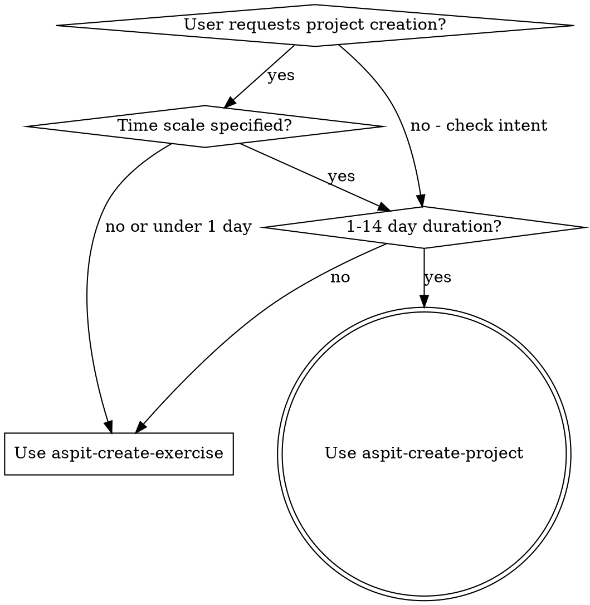

# ASPIT Project Creation

## Overview

This skill guides the creation of ASPIT (autism-friendly) course projects that span 1-14 days. Projects synthesize multiple curriculum concepts and include milestone-based structure, starter files, and example solutions.

**Core principle:** Projects must be neurodiversity-friendly - explicit language, numbered steps, clear success criteria, milestone checkpoints, and troubleshooting guidance.

## When to Use



**Use when:**
- User specifies "project" with time scale (days/weeks)
- Request is for multi-day assignment (1-14 days)
- Need to synthesize multiple curriculum topics
- User mentions "milestones", "phases", or "stages"

**Use aspit-create-exercise instead when:**
- Request is for quick practice activities (10-30 minutes)
- Single concept reinforcement
- User says "exercise" or "practice problems"

## Inputs Required

| Input | Description | Example | Required? |
|-------|-------------|---------|----------|
| **Module** | Course level | W1, W2, W3.1, W3.2 | Yes |
| **Topics** | Curriculum files OR topic descriptions | `06-js-functions.md` OR "functions, arrays, DOM" | Yes |
| **Time Scale** | Project duration | "1 day", "3 days", "1 week", "2 weeks" | Yes |
| **Project Name** | Descriptive name (kebab-case) | "personal-portfolio", "quiz-game" | Optional (auto-generated if omitted) |
| **Project Type** | Optional category | "website", "game", "tool", "app" | Optional |

**Example user requests:**
- "Create a 3-day W2 project covering JavaScript functions and DOM manipulation"
- "Build a 1-week W3.1 project using 05-php-forms.md and 06-mysql-intro.md"
- "Generate a 2-day project for W1 about semantic HTML and accessibility"

## Time-Based Scaling

The skill adjusts output complexity based on time estimate:

| Scale | Time | Task Count | Milestones | File Count | Starter Detail |
|-------|------|------------|------------|------------|----------------|
| **Short** | 1-2 days | 8-12 tasks | 2-3 | 2-4 | Basic skeleton with comments |
| **Medium** | 3-5 days | 15-25 tasks | 4-6 | 4-7 | Partial templates filled |
| **Long** | 1-2 weeks | 30-50 tasks | 8-12 | 7-12 | Detailed templates with structure |

**Scaling rules:**
- **Short projects**: Each milestone covers 1-2 major concepts, tasks are prescriptive
- **Medium projects**: Each milestone covers 2-3 concepts, balance of guidance and autonomy
- **Long projects**: Milestones represent phases (planning, implementation, testing, polish), more autonomy

## Folder Structure

```
{module}/projects/project-{XX}-{project-name}/
    ├── README.md
    ├── starter-files/
    │   ├── [HTML entry point]
    │   ├── [CSS if applicable]
    │   └── [JS/PHP/etc if applicable]
    └── example-solution/
        └── [complete working example]
```

**Naming conventions:**
- Use kebab-case: `project-01-quiz-game`, `project-02-portfolio-site`
- Number prefixes ensure sort order: 01, 02, 03...
- Project name should be descriptive

## README Template

Every project README MUST follow this structure:

```markdown
# Project: [Descriptive Title]

## Overview

[Brief 2-3 sentence description of what student will build]

[Real-world connection: how this applies beyond the exercise]

## Learning Objectives

By completing this project, you will be able to:

- [ ] [Specific, actionable objective 1]
- [ ] [Specific, actionable objective 2]

## Prerequisites

Before starting this project, you should have:

- Completed "[Curriculum Lesson Name]" ([lesson-file].md)
- [Previous project/concepts if building on foundations]
- [Any other specific requirements]

## Project Scope

- **Time Estimate**: ~X days
- **Difficulty**: [Beginner/Intermediate/Advanced]
- **Topics Covered**: [List main concepts]

## Requirements

### Functional Requirements

What the project must DO:

- [Requirement 1]
- [Requirement 2]

### Technical Requirements

How the project must be BUILT:

- [Technical constraint or practice 1]
- [Technical constraint or practice 2]

## Milestones

[For Short projects (1-2 days): 2-3 milestones]
[For Medium projects (3-5 days): 4-6 milestones]
[For Long projects (1-2 weeks): 8-12 milestones]

### Milestone 1: [Title]

**Goal**: [What student accomplishes]

**Tasks**:
1. [Specific step with clear directive]
   - [Detail if needed]
2. [Next specific step]

**Verify your work**:
- [ ] [Checkpoint 1]
- [ ] [Checkpoint 2]

---

[Repeat milestones for project scope]

## Starter Files

[Description of what's provided]
- [File 1]: [What it contains, what student needs to do]
- [File 2]: [What it contains, what student needs to do]

## Success Criteria

Before submitting, verify:

- [ ] [Functional requirement 1 is met]
- [ ] [Technical requirement 1 is met]
- [ ] [Code quality standard 1]
- [ ] [All milestones completed]

## Common Issues

### Issue: [Symptom students might see]

**Possible cause**: [Most likely reason]

**Fix**: [Specific solution]

[Include 4-6 common issues based on project scope]

## Extension Ideas

[Optional enhancements for faster students]
- [Enhancement idea 1]
- [Enhancement idea 2]

---

**Time Estimate**: ~X days
**Difficulty**: [Level]
```

## Starter File Guidelines

### Always Include

1. **Entry point file** (usually `index.html` for web projects)
2. **Basic structure** with extensive comments
3. **Placeholders** for where students write code

### File Content by Module

**W1 (HTML only):**
- HTML skeleton with semantic structure pre-written
- Content placeholders for student to fill
- Comments explaining each section

**W2 (HTML/CSS/JS):**
- HTML structure with some content
- CSS file with selectors or basic properties
- JS file with function signatures and comments

**W3.1 (Full Stack PHP):**
- Frontend HTML files
- Backend PHP file with database connection structure
- Comments showing where database queries go

**W3.2 (WordPress):**
- Theme template files with WordPress hooks identified
- Comments explaining template hierarchy
- functions.php with common patterns

## Example Solution Structure

The `example-solution/` folder contains a complete, working implementation that students can reference if stuck.

**Guidelines:**
- Fully functional - no TODOs or placeholders
- Well-commented but not over-explained
- Follows all requirements from the README
- Demonstrates best practices

## Neurodiversity Guidelines (From CLAUDE.md)

### Language & Communication

- **Use explicit, unambiguous language** - avoid "try this", "explore"
- **Provide concrete examples before abstract concepts** - show, then explain
- **Break complex tasks into numbered steps** - never group multiple actions
- **Include clear success criteria** - define what "done" looks like
- **Use consistent terminology** - match language used in curriculum
- **Anticipate common confusion points** - address in Common Issues

### Visual Structure

- **Use clear headings** - H1, H2, H3 hierarchy
- **Employ lists extensively** - numbered for sequences, bulleted for options
- **Format code blocks clearly** - always specify language
- **Provide visual separation** - horizontal lines between sections
- **Create clear checkpoints** - milestone verification criteria

### Content Presentation

- **Include validation checkpoints** - milestone verification sections
- **Offer multiple explanation approaches** when possible
- **Include troubleshooting sections** - 4-6 common issues

## Module-Specific Considerations

### W1 (HTML & CSS Only)

- **No JavaScript** - keep it strictly HTML/CSS
- **Focus on semantic structure** and accessibility
- **Introduce CSS gradually** if included in project scope
- **Real-world content** - build actual useful pages

### W2 (HTML, CSS & JavaScript)

- **Build on W1 foundation** - assume HTML/CSS knowledge
- **Focus on JavaScript concepts** - keep CSS simple
- **Include debugging guidance** - JS errors can be cryptic
- **Real interactivity** - projects should DO something meaningful

### W3.1 (Full Stack - PHP/Backend)

- **Separate concerns clearly** - frontend vs backend files
- **Show complete request/response cycle**
- **Include database examples** - SQL queries and results
- **Debug server errors** - common PHP/database issues

### W3.2 (WordPress)

- **Use WordPress patterns** - hooks, filters, template hierarchy
- **Explain the ecosystem** - themes, plugins, custom post types
- **Debug common issues** - plugin conflicts, theme problems
- **Practical themes** - real-world use cases

## Quick Reference

| Task | How |
|------|-----|
| Determine milestone count | Short: 2-3, Medium: 4-6, Long: 8-12 |
| Name projects | kebab-case, descriptive: `quiz-game`, `portfolio-site` |
| Set task count per milestone | Short: 3-4, Medium: 4-5, Long: 4-6 |
| Write verification | Specific checkable items after each milestone |
| Add troubleshooting | Think: "What will go wrong?" (4-6 issues) |
| Generate starter files | Always include, scale detail to project length |

## Key Differences from Exercise Skill

| Aspect | Exercise Skill | Project Skill |
|--------|---------------|---------------|
| **Duration** | 10-30 minutes | 1-14 days |
| **Scope** | Single concept | Multi-concept synthesis |
| **Structure** | Sequential task list | Milestone-based phases |
| **Files** | 1-3 files inline | 2-12 files in starter/ folders |
| **Difficulty** | Easy/Medium/Hard | Time-based (Short/Medium/Long) |
| **Scaffolding** | High (step-by-step) | Medium (milestone guidance) |
| **Solutions** | Inline in exercise folder | Separate example-solution/ |
| **Tasks** | 2-12 total | 8-50 total across milestones |

## Common Mistakes

### Mistake: Too much scaffolding

**Bad:** Every line of code prescribed, no student autonomy

**Good:** Milestone goals with clear checkpoints, room for student approaches

### Mistake: Vague milestones

**Bad:** "Build the frontend" - no clear criteria

**Good:** "Create HTML structure with header, main content area, and footer"

### Mistake: No verification points

**Bad:** Milestones with no way to check completion

**Good:** Each milestone has "Verify your work" checklist

### Mistake: Wrong time scaling

**Bad:** 2-day project has 8 milestones (too many for time)

**Good:** 2-day project has 2-3 milestones (4-5 tasks each)

## Implementation Steps

1. **Get inputs from user** - module, topics, time scale, optional name/type
2. **Read curriculum files** (if provided) - understand topics covered
3. **Determine tier** - Short/Medium/Long based on time scale
4. **Plan milestones** - set count and scope based on tier
5. **Plan tasks per milestone** - distribute based on tier guidelines
6. **Create folder structure** - project folder with starter-files/ and example-solution/
7. **Write README** - follow template exactly, incorporate neurodiversity guidelines
8. **Create starter files** - appropriate scaffolding for module and tier
9. **Create example solution** - complete working implementation
10. **Review** - check all accessibility checklist items
11. **Verify** - test that project works as expected

## Project Type Suggestions

When project type is unspecified or "auto", suggest based on module:

**W1:**
- Personal website
- Informational page
- Multi-page resource

**W2:**
- Interactive quiz/game
- Form-based tool
- Dynamic web app

**W3.1:**
- CRUD application
- Data management system
- User authentication flow

**W3.2:**
- Custom theme
- Plugin functionality
- Custom post type implementation
